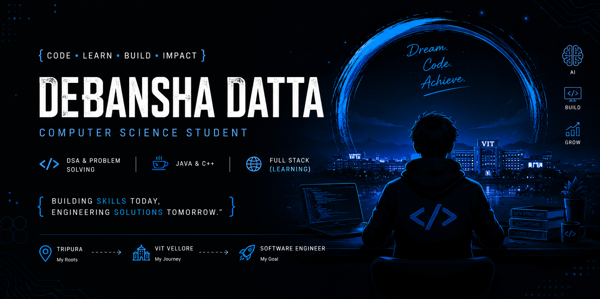

# Hi 👋 I'm Debansha Datta

### Computer Science Student @ VIT Vellore

Building skills today, engineering solutions tomorrow.

📍 Tripura, India

---

## 🚀 About Me

I'm a Computer Science student at VIT Vellore passionate about software development and problem solving.

Currently focused on:

- 🧩 Data Structures & Algorithms
- 🌐 Web Development
- 🤖 Artificial Intelligence
- 📚 CS Fundamentals

My goal is to become a Software Engineer who builds impactful products and scalable systems.

---

## 🎯 Current Goals

- [ ] Complete Striver A2Z DSA Sheet
- [ ] Learn Full Stack Development
- [ ] Build Strong Development Projects
---

## 💻 Tech Stack

---

## 📊 GitHub Stats

---

## ⚡ Journey

Tripura ➜ VIT Vellore ➜ Software Engineer

---

### Code. Learn. Build. Repeat.
